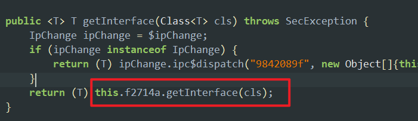
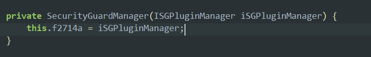
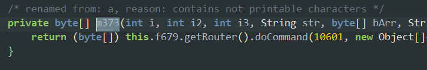
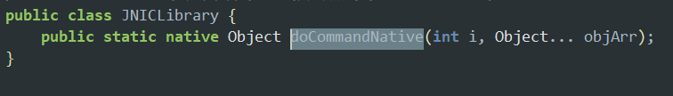
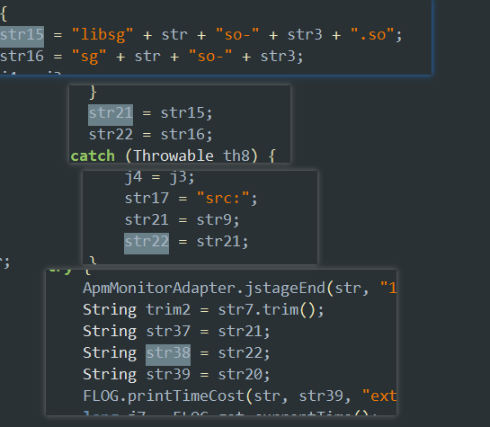

## 阿里 安全 sgmain 第一部分启动优化学习

### 饿了么

比如我们有这么一个常见爬虫需求，某个报文是post的，post的from表单中有一个sid字段，我们需要知道这个sid本质上是什么


抓包并分析某一个字段思路是最常见的场景，这种最简单的思路就是找到这个http报文是如何发送的，因为发送逻辑中往往会有from表单的构造。

对于http的发送，有可能在java层，也可能是native层。首先看报文特征，这是一个HTTP报文，后续分析也就只需要考虑http的报文，那么就可以直接用r0captrue来直接对app抓包，看一下含有MobileDispatch这个特征的报文，通过报文的调用栈我们可以确定下一步的分析。

通过r0captrue这个工具我们就确定了报文是java层发的，那么就可以用jadx反编译apk看java代码，也可以写脚本hook


java层一般都使用okhttp来发送，那么构造form表单时往往也会采用**hashmap**，那我们就直接hook hashmap

```js
Java.perform(function () {
    var HashMap = Java.use("java.util.HashMap");

    HashMap.put.overload('java.lang.Object', 'java.lang.Object').implementation = function (k, v) {
        if (k && k.toString().toLowerCase().indexOf("sid") !== -1) {
            console.log("HashMap.put: " + k + " = " + v);
            console.log(Java.use("android.util.Log").getStackTraceString(Java.use("java.lang.Exception").$new()));
        }
        return this.put(k, v);
    };
});

```

打印数据，报文中的sid值是1920287526162，我们在日志中搜索一下，确实有。那么通过hook就马上确定了sid的关键点在buildParamMap方法，当然反编译也可以达到同样的效果，灵活选择方法


通过堆栈定位到具体的类之后，就可以用jadx查看反编译的java代码，看一下这个方法，发现sid就是通过GlobalAppRuntimeInfo.getUserId()获取的，那么sid这个字段是一个账号的内部id应该没问题


这个MobileDispatch报文在绝大多数阿里系app中都有，但是只有饿了么有sid，但是MobileDispatch还有许多值得挖掘的地方。

### 淘宝

前面饿了么中我们发现sid是一个内部id，此外这个框架内还存在其他字段，淘宝是阿里系主要应用，且也存在MobileDispatch，于是在上面饿了么的分析基础上，我们接着研究淘宝APP中的其他字段。分析大概是两部分，第一部分是从一个加密问题看淘宝的启动优化，第二部分是分析安全加密的实现。

关键是secData这个字段，我们已经确定了淘宝该secData字段上传明文中存在userid，只是被加密了。

```
{"uPriority":"0","carrier":"wifi","mnc":"wifi","platformVersion":"13","deviceId":"aDvmxULI7YgDAFM7x1aMHmxS","sid":"2219xxx466"}
```

上面这个我们是怎么知道的呢？就是通过**JAVA层加密自吐**，hook java层的AES加密，发现加密结果存在于报文SecData中。

接下来是研究加密是否存在安全问题，要分析加密算法的安全问题。就不能只靠hook了，就要去看反编译的代码，把整个加密过程完整分析一下，通过hashmap我们发现，最终的密文调用的是ANET框架中SecurityHelper.encryptNoDeps


这个函数传入四个参数。前两个有用

```java
SecurityHelper.encryptNoDeps(SecurityHelper.getSecretKey(valueOf), new JSONObject(hashMap).toString(), amdcStatistic.seqNo, "[amdc]");
```

第一个参数是SecretKey，AES的密钥正是根据这个SecretKey生成的，我们已经知道了这个是AES加密，那么密钥生成是分析加密安全性的关键


看一下getKeyAndIvBytes方法，就是把SecretKey的md5取前16字节，同时作为AES加密密钥和iv


为了保险起见还是再看StringUtils.md5ToHex，确实是取md5


关键还是这个 SecretKey，加密的密钥和iv就是这个SecretKey的MD5的值，看一下SecretKey怎么来的，红色框说明SecurityHelper.getSecretKey的参数是一个**时间戳**


然后看SecurityHelper.getSecretKey方法，获取GlobalAppRuntimeInfo.getAppkey()然后拼接上这个时间戳


这个appkey我们可以在报文中找到，时间戳也可以在报文中获取到


那么也就是说，只要知道appkey和报文时间戳就完全得到了该字段aes加密密钥和iv，选一个报文对应时间戳是1749268079857的


由于要验证我们思路的正确性，且我们已经通过hook提前拿到了加密的明文，对明文用上面过程推导出的密钥进行加密，最终得到的密文和报文中传输的SecData，计算key的代码，这里不完整给出，其实非常简单，一定要自己动手分析，分析过程中去抄反编译代码即可。


对比报文中传输的密文，完全一致，这就证明了密钥计算的正确性和淘宝的SecData不安全性


SecData字段的密文可被解密，秘钥是根据t(时间戳)生成的


对密文进行逆运算得到明文，其中明文中的sid就是userid，

```json
{"uPriority":"0","carrier":"wifi","mnc":"wifi","platformVersion":"13","deviceId":"aDvmxULI7YgDAFM7x1aMHmxS","sid":"2219xxx466"}
```

作为一款常用app，淘宝似乎存在明文传输密钥的安全问题，虽然没有重要数据。此外且多个阿里系app都有“/amdc/mobileDispatch”这个特征的报文。每个app对应不同的appkey，这里给出几个常见的appkey

| APP名称   | appkey   |
| --------- | -------- |
| 淘宝/天猫 | 21646297 |
| 高德地图  | 21792629 |
| 饿了么    | 24895413 |
| 优酷      | 23570660 |

如法炮制，拿着appkey和时间戳去解密别的app报文，并未成功，服务器返回的数据也变成明文了，


这是怎么回事？作为一款常用app，淘宝对加密的使用真会犯如此简单的错误？

这里我们又回到反编译代码上，SecData有两种情况。主要差别从signtype就可以判断，当signtype是NoSec就是走encryptNoDeps，也就是我们分析的存在问题的加密；signtype为sec时又是对应另一种，好在绝大部分阿里系用的都是sec。后面我们只通过静态分析，来了解整个过程


关键是这个z的取值，我们分析一下。


必须复制出来这一句

```java
boolean z = currentTimeMillis - GlobalAppRuntimeInfo.getInitTime() <= AwcnConfig.getAmdcLightTime();
```

这里有一个getAmdcLightTime，字面意思是和轻量级启动有关。那么显然这句代码包括后面用到z的地方，都是和启动性能优化有关系，如果是轻量级启动，就走静态方法，加密也不考虑安全性；然而启动一段时间后就会转而走安全代码，此外，结合后面插件框架的代码可以知道这里轻量级启动的选择和淘宝的插件管理器也有关系。

这样来说，性能和安全性之间确实需要权衡，也说明我们其实是误解了淘宝。而其他阿里系app因为用户体量和使用频率的差异，可能并未如淘宝APP这般考虑周全，而是直接走sec场景。比如这里，就是调用sign对象的aesEncryptstr，也就是所谓的sec场景


看一下sec场景是否真的安全，这边的方法全是接口，需要一个一个找实现类，如果在当前方法找不到，就找相关set方法的引用


比如AmdcRuntimeInfo.getSign返回的是iSign，iSign就一定要有地方初始化，正是通过setSign初始化为iAmdcSign


而iAmdcSign只有一个实例化过程，也就确定了aesEncryptStr方法的最终实现是在这里


aesEncryptStr又是调用r3.getSecurity().aesEncryptStr(r2, str)，而r3是Config对象


在Config类找到getSecurity方法，又有两种情况，对应不同的实现类


结合两种情况的实现类发现NoSecurityGuardImpl返回的是null，肯定不会是NoSecurityGuardImpl


只可能是SecurityGuardImpl这个实现类中的aesEncryptStr方法

直观上是调用StaticDataEncryptComp的staticSafeEncrypt方法


而StaticDataEncryptComp又是securityGuardManager.getStaticDataEncryptComp获取的对象

这里我们要找到securityGuardManager.getStaticDataEncryptComp()的实现


找到a方法，参数为6。会先获取IStaticDataEncryptComponent.class接口再调用getInterface


继续看getInterface



这里this.f2714a是一个插件管理器，不断x找引用即可





最终是执行到com.alibaba.wireless.security.framework.d中的getInterface，getInterface又调用下面这个a方法，this.e是一个new ConcurrentHashMap<>()。很多安卓组件比如recyclerview、Retrofit的源码中，经常能看到ConcurrentHashMap，都是和缓存、高性能有关，能帮助我们举一反三。这里也说明动态加载插件时会先取缓存，可想而知：没缓存时动态加载加密套件耗时高于纯java加密，淘宝工程师势必做了大量测试，这也是为什么前面看似存在的加密问题其实是轻量级启动。

```java
 public <T> T a(Class<T> cls) throws SecException {
        String str;
        Object obj = this.e.get(cls);
     //优先从缓存加载插件
        if (obj != null) {
            return cls.cast(obj);
        }
        if (this.k != null) {
            str = this.k.e();
            if (str == null || str.length() == 0) {
                str = this.k.a(cls.getName());
            }
        } else {
            str = null;
        }
     //cls.getAnnotation(InterfacePluginInfo.class)从注解中获取插件名称
        if (str == null || str.length() == 0) {
            str = b((Class<?>) cls);
        }
        if (str == null || str.length() == 0) {
            throw new SecException(150);
        }
     //后续关键步骤
        ISGPluginInfo pluginInfo = getPluginInfo(str);
        if (pluginInfo == null) {
            if (this.f1245m && getMainPluginName().equals(str)) {
                throw new SecException(110);
            }
            return null;
        }
        Object obj2 = pluginInfo.getSGPluginEntry().getInterface(cls);
        if (obj2 != null) {
            this.e.put(cls, obj2);
            return cls.cast(obj2);
        }
        a(100045, 112, "", cls.getName(), str + "(" + pluginInfo.getVersion() + ")", d(pluginInfo.getPluginPath()), "");
        throw new SecException(112);
    }

```

由于我们是分析安全问题，框架源码放在其他文章中细读。总之阿里插件框架就是根据传入的接口注解名称去加载对应的插件，这里接口是IStaticDataEncryptComponent，调用的也是该接口插件实现类中的staticSafeEncrypt


这也是为什么我们在jadx直接搜staticSafeEncrypt搜不到，因为这个实现类是在sgmain这个插件中，根据注解main我们找到了sgmain.so


拖到ida显示是一个压缩包


是一个apk


看一下这个apk，找到了staticSafeEncrypt的实现,查看m373方法


m373中，得到f687对象，进一步路由，然后doCommand




也就是SecurityGuardMainPlugin执行路由


那也就是f28执行docommand


而f28一开始为null，那么根据阿里反编译的代码风格，一定是有地方初始化的


对于复杂的方法，反编译失败是很正常的事情，遇到这种情况只需要改一下jadx的设置，把这里勾选上，或者看Smali代码，麻烦一点。勾选后，重新反编译


对f28按一下“x”键就看到了赋值的地方


而docommand又调用JNICLibrary.doCommandNative(i, objArr)


这里是一个native方法



那么现在又有一个大问题了，这个doCommandNative是哪个so里面的方法呢？通过hook的技巧肯定可以知道，但是我们就只静态分析，来提高阅读代码的能力。我们要思考，这里插件化和性能密不可分，对so也应当按需加载，那么一定是在插件内部通过System.loadLibrary加载so，然后调用so里面的函数。

直接在插件的反编译代码搜，就在后面有一个System.loadLibrary


关键它so名称又是传进来的，看不到是什么，onPluginLoaded也找不到地方调用


难道一定要hook了吗？这时候再从开发的角度去思考问题，安卓开发中，最喜欢回调，onPluginLoaded有没有可能就是一个回调函数，插件管理器成功加载apk之后就会立即回调这个方法来初始化？

那么我们又回过头去看插件管理器的代码，看看有没有回调onPluginLoaded，直接在主app搜一下，真有


参数是str38，一直往上找这个字符串的来源


应该是这样的



应该就是这个so，这个才是真正的native实现


这里业务上要实现解密可以采用下面这种简单方法。对于一个集团性的框架，加密算法一般来说不会变化，安全性主要集中在密钥管理上：

①一次一密(随机key)，理论安全。上面NoSec的情况虽然也是一次一密，但是密钥采用明文传输。

②固定密钥

而这里我们通过分析APP自身调用解密时发现，调用解密函数只传了服务器的响应中的SecData作为参数，这就意味着很有可能是固定密钥


如何判断是不是固定密钥呢？**frida主动调用**。用frida附加app，多次主动调用解密方法，对同一个明文加密多次。如果结果都一样就是固定密钥。APP本身只从报文中opt了SecData，如果不是固定密钥，那就还要分析密钥交换的安全性


随便找个阿里系APP，用sign对打开的app附加两次，结果一样，说明密钥没有时间因子


关闭app重启，再次附加hook，结果仍然一致


抓包拿同一个报文中服务器响应的密文数据，看看能不能解密，发现也可以解出来


当然也可以利用unidbg补环境直接执行so，因为这个加密最终都是到so中执行。但是这些方式都存在部分问题：java层根据调用栈的深度能解的app数量不同。

电商场景是爬虫的重中之重，阿里so层的安全也是一座高峰，native这部分涉及到混淆和vmp，我们放在其他文章中详细分析。
